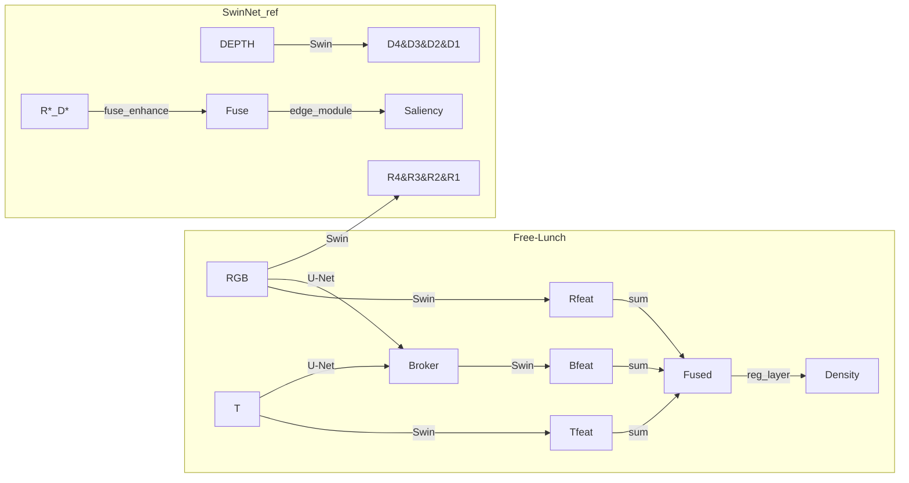

**Overview**

- **Project A (Free-Lunch):** Multimodal counting framework comprised of `Fine-tune/` (supervised counting) and `PPCA/` (self-supervised pretraining). The counting pipeline uses a Swin Transformer backbone, a U-Net–based broker, and multiple loss terms specialized for point-supervised density estimation.
- **Project B (SwinNet reference):** Swin-based RGB+depth saliency and edge model located at `.reference/SwinNet`. This model uses two Swin backbones and multi-scale attention fusion; supervision is pixel-wise (BCE) for saliency and edges.

**Key Files Inspected**

- **Free-Lunch:** `Fine-tune/models/counting/swin_unet.py`, `Fine-tune/models/distillation/unet_cross_att.py`, `Fine-tune/losses/ot_loss.py`, `Fine-tune/losses/LRD.py`, `Fine-tune/utils/dm_regression_trainer.py`, `PPCA/models/moco.py`, `PPCA/models/swin.py`.
- **SwinNet reference:** `.reference/SwinNet/models/Swin_Transformer.py`, `.reference/SwinNet/SwinNet_train.py`, `.reference/SwinNet/config.py`.

**Architectural Summary**

- **Common core (both projects):**
  - **Patch embedding:** convolutional patch projection, optional norm.
  - **Windowed attention:** local W-MSA / SW-MSA with relative positional bias.
  - **Hierarchical stages:** `BasicLayer` stacks of blocks + `PatchMerging` downsampling.

- **Free-Lunch (counting)** — succinct description:
  - **Broker U-Net:** encoder–decoder + cross-attention between RGB and thermal; output = broker modality.
  - **Backbone:** single Swin encoder applied to RGB, thermal, and broker outputs (same weights shared in `Swin_BM_RGBT`).
  - **Fusion & head:** elementwise sum of per-modality Swin features: `features = r + t + b`; `reg_layer` (small conv stack) → single-channel density map.

- **SwinNet reference (saliency)** — succinct description:
  - **Dual backbones:** two independent Swin encoders (`rgb_swin`, `depth_swin`) with Swin-B configuration (embed_dim=128, depths=[2,2,18,2]).
  - **Multi-scale fusion:** `fuse_enhance` blocks perform channel & spatial attention and combine multiscale maps via elementwise multiplication/addition followed by progressive upsampling.
  - **Auxiliary edge module:** predicts edges which are fused into final saliency output.

**Losses and Training Objectives**

- **Free-Lunch (counting — `Fine-tune`)**
  - **Count MAE:** L1 on predicted count vs. ground-truth point count.
  - **OT loss (Sinkhorn):** distribution alignment between normalized predicted density and point-based target (implemented in `ot_loss.py`). Weight: `--wot`.
  - **TV-like loss:** L1 between normalized density maps for local consistency. Weight: `--wtv`.
  - **Regional Density (RD):** contrastive-style loss on pooled subregion features (`LRD.py`). Weight: `--wrd`.
  - **Optimizer:** Adam (default lr=1e-5), no LR scheduler in the fine-tune trainer.

- **PPCA (pretraining)**
  - **MoCo-style contrastive loss** across modalities (RGB, thermal, broker) with queue. Optimizer: Adam + warm-up cosine schedule (LambdaLR).

- **SwinNet reference (saliency)**
  - **Pixel BCE losses:** `BCEWithLogitsLoss` for saliency and `BCELoss` for edges. Optimizer: Adam with custom LR adjust (`adjust_lr`) and gradient clipping; config supported for `adamw`, cosine schedule, warmup.

**Principal Differences (concise)**

- **Task:** counting (point supervision, distributional losses) vs. saliency (pixel supervision, BCE).
- **Fusion:** additive sum of modality features (Free-Lunch) vs. learned multiscale attention fusion (SwinNet_ref).
- **Backbone usage:** shared single-backbone application to broker + modalities (Free-Lunch) vs. dual independent backbones (SwinNet_ref).
- **Loss design:** OT + MAE + RD + TV (Free-Lunch) vs. BCE saliency/edge (SwinNet_ref).
- **Training schedules:** Free-Lunch fine-tune uses simple Adam; PPCA uses warm-up + cosine; SwinNet_ref supports `adamw` + cosine + other modern configs).