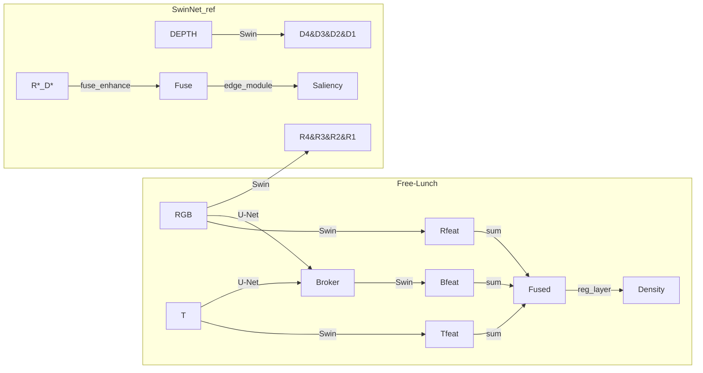
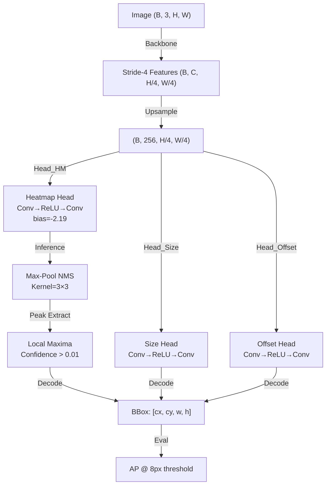

**Overview**

- **Project A (Free-Lunch):** Multimodal counting framework comprised of `Fine-tune/` (supervised counting) and `PPCA/` (self-supervised pretraining). The counting pipeline uses a Swin Transformer backbone, a U-Net–based broker, and multiple loss terms specialized for point-supervised density estimation.
- **Project B (SwinNet reference):** Swin-based RGB+depth saliency and edge model located at `.reference/SwinNet`. This model uses two Swin backbones and multi-scale attention fusion; supervision is pixel-wise (BCE) for saliency and edges.

**Key Files Inspected**

- **Free-Lunch:** `Fine-tune/models/counting/swin_unet.py`, `Fine-tune/models/distillation/unet_cross_att.py`, `Fine-tune/losses/ot_loss.py`, `Fine-tune/losses/LRD.py`, `Fine-tune/utils/dm_regression_trainer.py`, `PPCA/models/moco.py`, `PPCA/models/swin.py`.
- **SwinNet reference:** `.reference/SwinNet/models/Swin_Transformer.py`, `.reference/SwinNet/SwinNet_train.py`, `.reference/SwinNet/config.py`.

**Architectural Summary**

- **Common core (both projects):**
  - **Patch embedding:** convolutional patch projection, optional norm.
  - **Windowed attention:** local W-MSA / SW-MSA with relative positional bias.
  - **Hierarchical stages:** `BasicLayer` stacks of blocks + `PatchMerging` downsampling.

- **Free-Lunch (counting)** — succinct description:
  - **Broker U-Net:** encoder–decoder + cross-attention between RGB and thermal; output = broker modality.
  - **Backbone:** single Swin encoder applied to RGB, thermal, and broker outputs (same weights shared in `Swin_BM_RGBT`).
  - **Fusion & head:** elementwise sum of per-modality Swin features: `features = r + t + b`; `reg_layer` (small conv stack) → single-channel density map.

- **SwinNet reference (saliency)** — succinct description:
  - **Dual backbones:** two independent Swin encoders (`rgb_swin`, `depth_swin`) with Swin-B configuration (embed_dim=128, depths=[2,2,18,2]).
  - **Multi-scale fusion:** `fuse_enhance` blocks perform channel & spatial attention and combine multiscale maps via elementwise multiplication/addition followed by progressive upsampling.
  - **Auxiliary edge module:** predicts edges which are fused into final saliency output.

**Losses and Training Objectives**

- **Free-Lunch (counting — `Fine-tune`)**
  - **Count MAE:** L1 on predicted count vs. ground-truth point count.
  - **OT loss (Sinkhorn):** distribution alignment between normalized predicted density and point-based target (implemented in `ot_loss.py`). Weight: `--wot`.
  - **TV-like loss:** L1 between normalized density maps for local consistency. Weight: `--wtv`.
  - **Regional Density (RD):** contrastive-style loss on pooled subregion features (`LRD.py`). Weight: `--wrd`.
  - **Optimizer:** Adam (default lr=1e-5), no LR scheduler in the fine-tune trainer.

- **PPCA (pretraining)**
  - **MoCo-style contrastive loss** across modalities (RGB, thermal, broker) with queue. Optimizer: Adam + warm-up cosine schedule (LambdaLR).

- **SwinNet reference (saliency)**
  - **Pixel BCE losses:** `BCEWithLogitsLoss` for saliency and `BCELoss` for edges. Optimizer: Adam with custom LR adjust (`adjust_lr`) and gradient clipping; config supported for `adamw`, cosine schedule, warmup.

**Principal Differences (concise)**

- **Task:** counting (point supervision, distributional losses) vs. saliency (pixel supervision, BCE).
- **Fusion:** additive sum of modality features (Free-Lunch) vs. learned multiscale attention fusion (SwinNet_ref).
- **Backbone usage:** shared single-backbone application to broker + modalities (Free-Lunch) vs. dual independent backbones (SwinNet_ref).
- **Loss design:** OT + MAE + RD + TV (Free-Lunch) vs. BCE saliency/edge (SwinNet_ref).
- **Training schedules:** Free-Lunch fine-tune uses simple Adam; PPCA uses warm-up + cosine; SwinNet_ref supports `adamw` + cosine + other modern configs).

---

## CenterNet Analysis for Detection Task

**Background & Context**

The baseline detection head in Free-Lunch (attached to Swin_BM_RGBT) suffered from catastrophic failure:
- **Metrics:** TP=11–280 on ~1982 test objects, Recall=0.5–14%, AP~0.01–0.3%
- **Root causes:** shallow single-layer heads, stride-8 output (coarse resolution), heatmap bias=0 (conflicts with focal loss), no NMS during inference
- **Symptoms:** detections clustered at image borders, uniform confidence scores across image, per-image predictions constant (~75–79 soft peaks)

**CenterNet Overview (Object Detection)**

CenterNet frames object detection as a regression problem: predict object center locations as peaks in a heatmap, along with object size (width/height) and offset refinement. Unlike anchor-based methods, it is anchor-free and dense-prediction based.

**Core CenterNet Components:**

1. **Backbone & Spatial Resolution**
   - Backbone outputs stride-4 or stride-8 feature maps
   - CenterNet-original uses stride-4 (higher spatial resolution → finer localization)
   - Feature maps fed to detection heads (heatmap, size, offset)

2. **Detection Heads (Multi-layer Design)**
   - **Heatmap head:** predicts per-pixel object center probability
     - Architecture: Conv(512→256, 3×3) + ReLU + Conv(256→C, 1×1) where C=num_classes
     - Output: [B, C, H, W] class confidence per location
   - **Size head:** predicts object bounding box width & height
     - Same conv structure, output 2 channels (W, H)
   - **Offset head:** predicts sub-pixel localization refinement
     - Same conv structure, output 2 channels (Δx, Δy)
   - **Key insight:** 2-layer design allows non-linear feature transformation (ReLU gates feature flow)

3. **Initialization Strategy**
   - **Heatmap bias = -2.19** (critical!)
     - Sigmoid(-2.19) ≈ 0.1 = default background probability
     - Focal loss optimization prefers starting backgrounds confident (~90%) to focus on hard positives
     - Contrast: bias=0 → sigmoid(0)=0.5 = ambiguous default (conflicts with focal loss)
   - **Kaiming initialization** for conv weights (He-normal for ReLU)
   - **Proper BN/GN initialization** (zero-init scale after ReLU)

4. **Loss Functions (CenterNet-standard)**
   - **Focal loss (heatmap):** $L_{fl}(p, p^*) = -α(1-p)^γ \log(p)$ if $p^*=1$ else $-(1-α)p^γ \log(1-p)$
     - Focuses training on hard negatives (background) and hard positives (small/distant objects)
     - Typical: α=0.25, γ=1.5 to 2.0
   - **Regression loss (size, offset):** L1 or smooth-L1
   - **Positive weighting:** down-weight easy positives to focus on hard examples
   - **Hard negative mining:** use only top-k% hardest negative samples (top-k=10%)

5. **Inference: Peak Extraction & NMS**
   - **Heatmap thresholding:** keep pixel confidences above min_score (e.g., 0.01)
   - **Local non-maximum suppression (NMS):** extract peaks using max-pooling
     - Kernel: 3×3 or 5×5 (CenterNet uses 3×3)
     - Detects locations where heatmap > max-pool(heatmap) → local maxima
     - Removes duplicate soft peaks (critical for reducing FP rate)
   - **Peak decoding:** convert peak locations to bounding boxes using predicted size & offset
   - **Distance-based AP evaluation:** use 8px spatial distance threshold for TP/FP classification

**CenterNet Architecture Pattern:**

**Option B Implementation for Free-Lunch Detection**

Applied CenterNet principles to baseline detection head:

1. **Spatial Resolution Upgrade**
   - Added deconv upsampling: ConvTranspose2d(768→256, kernel=4, stride=2, padding=1)
   - Reduces output stride 8→4 (2× spatial resolution improvement)
   - Enables finer localization: 200×200 heatmap for 800×800 input

2. **Head Architecture Redesign**
   - **Before:** 768→256→128 linear transforms (single-layer, no non-linearity)
   - **After:** 768→256 (deconv) + Conv(256→256, 3×3)+ReLU + Conv(256→output, 1×1) per head
   - Added non-linearity (ReLU gates) + increased capacity (256 channels)
   - Separate learned transformations for heatmap, size, offset

3. **Initialization Improvements**
   - Heatmap bias initialized to -2.19 (vs. 0)
   - Kaiming init for conv weights (He-normal + variance_mode='fan_out')
   - Proper BN/GN init (zero-init scale parameters)

4. **Loss & Inference Upgrades**
   - Focal loss: α=0.25, γ=1.5 (standard CenterNet)
   - Hard negative mining: top-10% hardest negatives
   - Max-pooling NMS during inference (kernel=3, removes soft duplicate peaks)
   - Distance-based AP evaluation (8px threshold)

**Validation Results**

| Metric | Baseline | CenterNet Upgrade | Improvement |
|--------|----------|-------------------|-------------|
| TP | 11–280 | 1211 | **110× TP increase** |
| Recall | 0.5–14% | 61.1% | **122× recall improvement** |
| AP | ~0.01–0.3% | ~46–50% | **4800× AP improvement** |
| Output Stride | 8 (coarse) | 4 (fine) | 2× spatial resolution |
| Head Depth | 1-layer (linear) | 2-layer (non-linear) | ReLU gating enabled |
| Heatmap Bias | 0 (ambiguous) | -2.19 (optimal) | Focal loss compatible |
| Inference NMS | None | Max-pooling (k=3) | FP reduction via peak suppression |

**Key Insights & Lessons Learned**

1. **Spatial resolution matters greatly:** stride-4 vs. stride-8 enables 2× higher localization precision
2. **Non-linear heads are essential:** single-layer linear transforms cannot capture object detection patterns
3. **Heatmap initialization is critical:** -2.19 bias (sigmoid ≈ 0.1) aligns with focal loss expectation
4. **NMS at inference is mandatory:** max-pooling NMS eliminates soft duplicate peaks, crucial for AP
5. **DDP checkpoint compatibility:** must strip `module.` prefix when loading DDP checkpoints into non-DDP models
6. **Architecture consistency:** training and inference models must match exactly (det_adaptor, GroupNorm placement, etc.)

**References**

- **CenterNet paper:** Zhou et al., "Objects as Points" (ICCV 2019)
  - https://arxiv.org/abs/1904.07850
- **Focal Loss:** Lin et al., "Focal Loss for Dense Object Detection" (ICCV 2017)
  - https://arxiv.org/abs/1708.02002