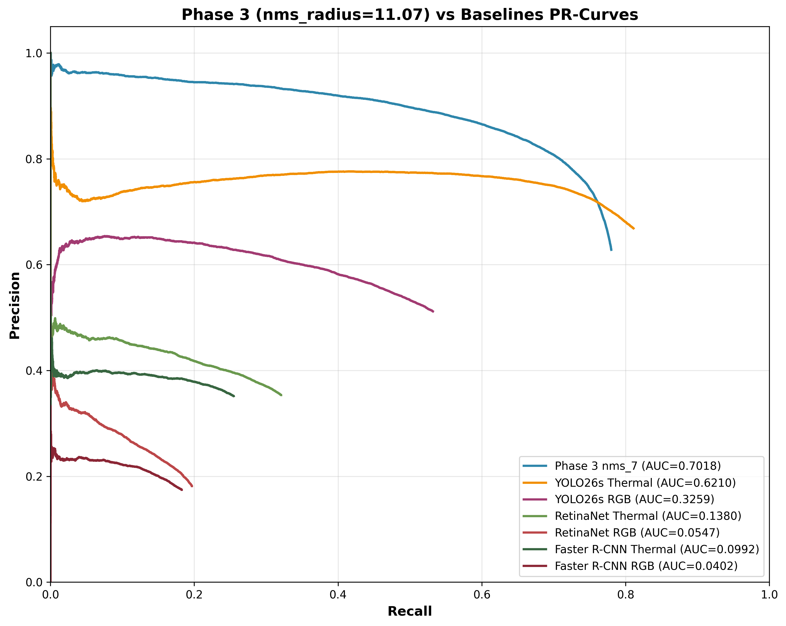

# Detection and Recognition From Aerial Drones

This repository contains a City University of Hong Kong (CityUHK) final-year project on RGB-T (RGB + Thermal) aerial human detection and counting.

The implementation extends the CVPR 2025 Free-Lunch multimodal counting framework with a CenterNet-style keypoint detection head for small-object localization in drone imagery.


## Project Status

- Project complete (April 2026)
- Standard evaluation metric: AP@8px (distance-based)
- Best AP checkpoint for benchmark comparison: `phase6_3_best_model_epoch_40.pth`
- Adopted deployment-oriented checkpoint: `phase6_5_best_model_epoch_68.pth`
- Model on Hugging Face: [Edison2525/Detection-and-Recognition-From-Aerial-Drones-FYP](https://huggingface.co/Edison2525/Detection-and-Recognition-From-Aerial-Drones-FYP)

## Quick Start

### 1) Environment and Data

Follow the full setup instructions in [docs/SETUP.md](docs/SETUP.md).

### 2) Visual Inference (AP@8px)

Phase 6.3 (best AP benchmark checkpoint):

```bash
python3 Fine-tune/test_detection_vis.py \
  --ckpt phase6_3_best_model_epoch_40.pth \
  --data-dir .data/DroneRGBT_converted \
  --num 64 \
  --use-deconv \
  --use-fpn \
  --keypoint-mode \
  --use-bce-logits \
  --det-use-gn \
  --head-conv 256
```

### 3) Full Diagnostics

```bash
bash tools/run_posttrain_diagnostics.sh \
  phase6_3_best_model_epoch_40.pth \
  .data/DroneRGBT_converted
```

## AP@8px Results Summary

### DroneRGBT (Main Dataset)

| Model / Mode | AP@8px | Precision | Recall | F1 |
|---|---:|---:|---:|---:|
| Phase 6.3 (RAW) | 0.5908 | 0.5642 | 0.7009 | 0.6252 |
| Phase 6.3 (Fair NMS r=11.07) | **0.7018** | **0.7868** | 0.7204 | **0.7521** |
| Phase 6.5 (RAW) | 0.5622 | 0.5641 | 0.6993 | 0.6245 |
| YOLO26s (Thermal baseline) | 0.6210 | 0.6685 | **0.8111** | 0.7329 |
| RetinaNet (Thermal baseline) | 0.1380 | 0.6945 | 0.6307 | 0.6611 |
| Faster R-CNN (Thermal baseline) | 0.0992 | 0.7337 | 0.5323 | 0.6170 |

Key takeaways:
- Phase 6.3 (RGBT fusion) achieves +13% AP vs YOLO26s Thermal baseline.
- Anchor-free design performs substantially better than anchor-based baselines on small aerial objects.

For full benchmark methodology, derivations, and visual comparisons, see [docs/INFERENCE.md](docs/INFERENCE.md).

## Representative Visual Comparison (AP@8px)

The samples below compare each model's performance on the same scenes (`Image 30` and `Image 117`).

| Model | Image 30 | Image 117 |
|---|---|---|
| Faster R-CNN (RGB) |  |  |
| Faster R-CNN (Thermal) |  |  |
| RetinaNet (RGB) |  |  |
| RetinaNet (Thermal) |  |  |
| YOLO26s (RGB) |  |  |
| YOLO26s (Thermal) |  |  |

Ours: Phase 6.3 (RGBT) - Image 30 

Ours: Phase 6.3 (RGBT) - Image 117 


Notes:
- Baseline images show RGB and Thermal modality results from their native pipelines.
- Our images are report-sourced AP@8px outputs (Phase 6.3 fair-comparison setting).
- Full quantitative analysis is in [docs/INFERENCE.md](docs/INFERENCE.md).



## Documentation Map

- [docs/SETUP.md](docs/SETUP.md): Environment setup, dependencies, dataset preparation
- [docs/TRAINING.md](docs/TRAINING.md): Training configurations and hyperparameter tuning
- [docs/INFERENCE.md](docs/INFERENCE.md): Evaluation modes, AP@8px metrics, parameter tuning
- [docs/ARCHITECTURE.md](docs/ARCHITECTURE.md): System architecture and model components
- [docs/DEVELOPMENT.md](docs/DEVELOPMENT.md): Phase-by-phase evolution and ablation history
- [docs/KNOWN_ISSUES.md](docs/KNOWN_ISSUES.md): Failed approaches and what to avoid
- [docs/LESSONS_LEARNED.md](docs/LESSONS_LEARNED.md): Design rationale and validated insights
- [docs/FAQ.md](docs/FAQ.md): Common setup/training/inference questions
- [docs/TOOLS.md](docs/TOOLS.md): Utility scripts reference

## Repository Layout

- [Fine-tune/](Fine-tune/): Main training and inference code
- [baselines/](baselines/): Baseline model scripts (Faster R-CNN, RetinaNet, YOLO)
- [tools/](tools/): Data conversion, diagnostics, and analysis utilities
- [docs/](docs/): Documentation
- [image/](image/): Figures and comparison outputs used by docs

## Acknowledgments

- Supervisor: Prof. Chun Pong LAU
- Base framework: [Free-Lunch Enhancements for Multi-modal Crowd Counting](https://github.com/HenryCilence/Free-Lunch-Multimodal-Counting)
- Datasets: [DroneRGBT](https://github.com/VisDrone/DroneRGBT), [RGBT-CC](https://github.com/chen-judge/RGBTCrowdCounting)

See team and contribution details in [AUTHORS.md](AUTHORS.md).

## License

Licensed under MIT. See [LICENSE](LICENSE).
