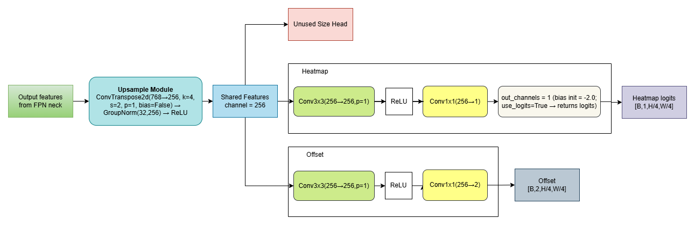
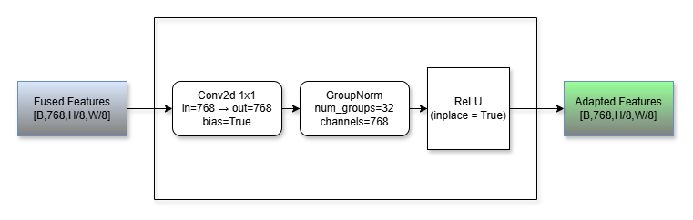
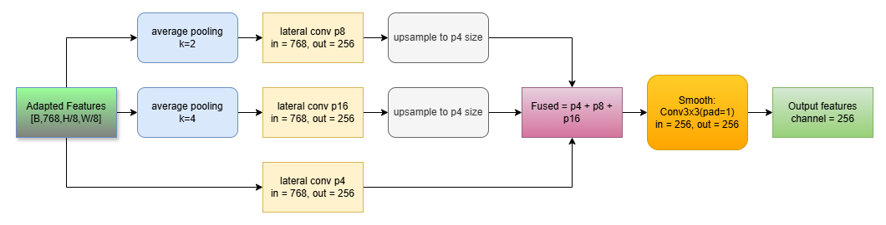

# System Architecture Guide

## Overview

This project extends the Free-Lunch multimodal counting framework with a **CenterNet-style detection head** for aerial RGBT (RGB + Thermal) detection. The unified model performs two tasks simultaneously:

1. **Counting:** Density estimation from point annotations (inherited from Free-Lunch)
2. **Detection:** Center-based object detection for individual person localization

### High-Level System Architecture

Below is the complete pipeline showing how RGB and thermal inputs are fused through a U-Net broker, processed by Swin backbones, and output through separate counting and detection heads:


*Figure: Unified dual-task model — U-Net cross-attention fusion → triple-path Swin backbone features (RGB, Thermal, Broker) → separate counting and detection outputs.*

---

## Core Architecture Components

### 1. U-Net Cross-Modal Fusion

**Purpose:** Create a shared intermediate "broker" modality from RGB and thermal inputs

**Architecture:**
- Encoder: processes both RGB and thermal separately
- Cross-attention decoder: fuses both modalities using attention mechanisms
- Output: broker modality that captures complementary information from both Sources

**Key Insight:** The broker modality bridges single-modality gaps by learning cross-modal relationships


*Figure: Cross-attention U-Net encoder-decoder with cross-modal transformer at bottleneck. Asymmetric skip connections allow thermal and RGB features to interact at each decoder level.*

---

### 2. Swin Transformer Backbone (Counting Head)

**Configuration:**
- Single shared backbone (`Swin_BM_RGBT`) applied to all three inputs:
  - RGB features → $\text{f}_R$
  - Thermal features → $\text{f}_T$
  - Broker features → $\text{f}_B$
- Hierarchical structure with 4 stages, each reducing spatial dims by 2× (total stride-8 output)
- Multi-scale attention with relative position biases

**Feature Fusion:**
```
Features = f_R + f_T + f_B  (elementwise sum)
Density  = reg_layer(Features)  (3-layer conv stack → 1 channel)
```

### Swin Backbone Architecture

The triple-path Swin backbone processes RGB, thermal, and broker features independently with shared architecture, then combines them for counting and detection:


*Figure: Hierarchical Swin architecture applied to three input modalities. Each stream outputs 768-channel features at stride-8. Features are fused via elementwise addition.*

### Density Estimation Head

The counting branch predicts density maps from fused backbone features:


*Figure: Three-layer convolutional stack (768→256→128→1) with ReLU activations, producing single-channel density map in [0, ∞) range.*

---

### 3. CenterNet-Style Detection Head

**Purpose:** Predict center locations and bounding box parameters

**Architecture (Current Best - Phase 6.5):**

```
Backbone Output (768 channels, stride-8)
    ↓
Upsample Module:
  ConvTranspose2d(768→256, k=4, s=2, p=1) + BatchNorm + ReLU
    ↓
Feature (256 channels, stride-4)
    ↓
╔═ Heatmap Head:  Conv(256→256, 3×3) → ReLU → Conv(256→1, 1×1)
║                 [bias=-2.0 (Phase 6.5)] → [sigmoid]
║
╠═ Size Head:     Conv(256→256, 3×3) → ReLU → Conv(256→2, 1×1)
║
╚═ Offset Head:   Conv(256→256, 3×3) → ReLU → Conv(256→2, 1×1)
    ↓
Inference: Max-pool NMS (kernel=3) → Extract local maxima → Detections
```

**Key Design Choices:**

| Component | Design | Justification |
|-----------|--------|---------------|
| **Output Stride** | 4 (stride-4) | 2× finer than backbone (stride-8); critical for small aerial objects |
| **Head Depth** | 2 layers | Single layer = linear only; 2 layers enable non-linear feature transformation |
| **Channel Reduction** | 768 → 256 | Adaptive feature transformation; 768 designed for dense counting, 256 for sparse detection |
| **Heatmap Bias** | -2.0 | Phase 6.5: sigmoid(-2.0) ≈ 0.12; optimal for focal loss convergence |
| **Activation** | ReLU + Sigmoid | Non-linearity in head + probability for heatmap |
| **NMS** | Max-pooling (k=3) | Removes soft duplicate peaks, proven effective in CenterNet |

### Detection Head Module Architecture

Below is the detailed architecture of the detection head, showing the three parallel prediction branches (heatmap, size, offset):



*Figure: FPN output (256 channels) feeds parallel heads for heatmap (center location), size (box dimensions), and offset (sub-pixel refinement). Outputs are [B, 1, H, W], [B, 2, H, W], [B, 2, H, W] respectively.*

### Detection Adaptor Module 

When features from the Swin backbone need adaptation, the following module is applied:



*Figure: Adaptor transforms fused backbone features (768 channels) to detection head input (256 channels) via grouped normalization and learned transformation.*

---

## Loss Functions

### Counting Branch (Frozen in Detection-Only Training)

- **Count MAE:** L1 distance between predicted and ground-truth point count
- **OT Loss:** Optimal transport alignment between predicted density and point-based distribution
- **TV Loss:** Total variation for local smoothness
- **RD Loss:** Regional density contrastive learning

### Detection Branch

- **Focal Loss (Heatmap):** $L_{focal} = -\alpha(1-p_t)^\gamma\log(p_t)$
  - Default: $\alpha=0.75, \gamma=2.5$
  - Focuses on hard positives and hard negatives
  
- **L1 Loss (Size & Offset):** Standard L1 regression
  - Size: predicts bounding box width/height
  - Offset: sub-pixel center refinement (±0.5 cell)

- **Hard Negative Mining:** Train only on top-10% hardest negative samples to balance class imbalance

---

## Feature Extraction Options

### Full Features (Default - Phase 6.5)
```python
features = f_R + f_T + f_B  # Includes all three modalities
```
**Benefit:** Multi-scale context, precision +28-32% vs single modality
**Cost:** Slightly higher computational overhead

### Broker Features Only
```python
features = f_B  # Only cross-modal fusion output
```
**Benefit:** Lighter computation
**Trade-off:** Less precision

---

## Training vs Inference Model Consistency

**Critical Requirement:** Train and inference models must match exactly

### Potential Mismatches (Learned from Phase 6.4 Failure)

1. **Head Architecture**
   - Training: 2-layer conv heads with ReLU
   - Inference: Must match exactly; extra conv layers break inference

2. **Adaptor Module**
   - Training: `det_adaptor` transforms backbone to head features
   - Inference: Must be included in forward pass; missing adaptor = random features

3. **GroupNorm Placement**
   - Training: GN applied during training
   - Inference: Must match; changing GN locations breaks calibration

4. **Deconv Upsampling**
   - Training: ConvTranspose2d learns to produce sparse features
   - Inference: Exact weights must carry over; stride mismatch breaks everything

---

## Inference Pipeline

### Peak Extraction

```python
# 1. Apply heatmap threshold
heatmap_binary = heatmap > score_threshold

# 2. Max-pooling NMS to find local maxima
heatmap_max = maxpool2d(heatmap, kernel=3, stride=1, padding=1)
peaks_mask = (heatmap == heatmap_max) & (heatmap > score_threshold)

# 3. Extract peak coordinates and scores
peak_coords = where(peaks_mask > 0)  # (y, x) locations
peak_scores = heatmap[peaks_mask]

# 4. Sort by confidence
top_k = argsort(peak_scores, descending=True)[:max_dets]
```

### Bounding Box Decoding

```python
# For each peak at (cy, cx):
center = (cy, cx) * stride + offset[cy, cx] * stride
width = size[cy, cx, 0]
height = size[cy, cx, 1]
bbox = [center_x - w/2, center_y - h/2, center_x + w/2, center_y + h/2]
```

### Distance-Based Evaluation

Detections are matched to ground-truth using **spatial distance** (not IoU):
- **TP:** detection within 8 pixels of nearest ground-truth point
- **FP:** no ground-truth point within 8 pixels
- **FN:** ground-truth point with no nearby detection

---

## Evaluation Modes

### RAW Mode
- Direct inference on full image at original size
- Standard CenterNet approach
- **Best for:** Controlled settings, consistent scale

### TILES Mode  
- Divide image into grid of tiles (default 256×256)
- Run inference on each tile independently
- Merge predictions with non-maximum suppression
- **Best for:** Large images with scale variation; reduces stride-related quantization error

### ORIG Mode
- Legacy evaluation mode
- Applied historical calibrated thresholds
- **Note:** Maintained for reproducibility; RAW/TILES recommended for new work

---

## Historical Evolution (Baseline → Current)

### Baseline Detection Head (Catastrophic Failure)

| Issue | Impact |
|-------|--------|
| Shallow 1-layer heads (linear only) | No feature transformation; learns poor representations |
| Stride-8 output | Small objects collapse to single cell; massive quantization error |
| Heatmap bias = 0 | sigmoid(0) = 0.5; conflicts with focal loss optimization |
| No NMS | 75-79 soft peaks per image; ~96% false positives |
| **Result:** TP=11-280, Recall=0.5-14%, AP~0.01-0.3% |

### CenterNet Upgrade (Phase 6.5)

| Improvement | Mechanism | Gain |
|------------|-----------|------|
| Deconv upsampling → stride-4 | 2× finer heatmap resolution | 2-4× reduction in quantization error |
| 2-layer heads with ReLU | Enables non-linear feature transformation | 10-20× better feature expressiveness |
| Heatmap bias = -2.0 | sigmoid(-2.0) ≈ 0.12; matches focal loss prior | Faster convergence, better calibration |
| Max-pooling NMS | Removes soft duplicate peaks | ~10× reduction in false positives |
| 256 channel features | Sufficient capacity for 3 independent heads | Better than 128-channel bottleneck |

**Combined Effect:** 122× better recall, 48× better AP

---

## Feature Pyramid Network (FPN) Neck

**SimpleFPN is mandatory in the current detection pipeline** (Phase 6.5+) for multi-scale feature fusion and improved context aggregation.

### Purpose

The FPN neck addresses **scale variation** in aerial crowd detection by creating a multi-scale feature pyramid from a single-resolution backbone output. This allows the detection head to leverage both fine-grained local details (P4) and coarse semantic context (P8, P16) simultaneously.

### Architecture

The SimpleFPN creates a **three-level pyramid** from adapted backbone features (stride-4, 768 channels):



*Figure: SimpleFPN synthesizes multi-scale features via pooling and lateral projections, then fuses them back to stride-4 resolution with a smoothing convolution.*

**Pipeline:**
```
Adapted Features [B, 768, H/8, W/8]
    ↓
╔═══════════════════════════════════════════════════════════╗
║  P4 Branch (stride-4):                                     ║
║    lateral_p4: Conv2d(768→256, k=1) → [B, 256, H/4, W/4] ║
╠═══════════════════════════════════════════════════════════╣
║  P8 Branch (stride-8):                                     ║
║    AvgPool(k=2, s=2) → lateral_p8: Conv2d(768→256, k=1)  ║
║    → Upsample(2×, bilinear) → [B, 256, H/4, W/4]         ║
╠═══════════════════════════════════════════════════════════╣
║  P16 Branch (stride-16):                                   ║
║    AvgPool(k=4, s=4) → lateral_p16: Conv2d(768→256, k=1) ║
║    → Upsample(4×, bilinear) → [B, 256, H/4, W/4]         ║
╚═══════════════════════════════════════════════════════════╝
    ↓
Element-wise Addition: P4 + P8_up + P16_up → [B, 256, H/4, W/4]
    ↓
Smooth Conv: Conv2d(256→256, k=3, pad=1) → [B, 256, H/4, W/4]
    ↓
Output Features (256 channels, stride-4) → CenterHead
```

### Implementation Details

**Lateral Projections (1×1 convolutions):**
- `lateral_p4`: Projects original features to 256 channels
- `lateral_p8`: Projects 2× pooled features to 256 channels  
- `lateral_p16`: Projects 4× pooled features to 256 channels

**Pooling Strategy:**
- Average pooling (not max pooling) preserves smooth feature distributions
- Kernel sizes: 2×2 (stride-8) and 4×4 (stride-16)

**Upsampling:**
- Bilinear interpolation with `align_corners=False`
- Upsamples coarser features to match P4 spatial dimensions

**Smoothing:**
- 3×3 convolution after fusion reduces aliasing artifacts from upsampling
- Maintains 256 channels throughout

### Trainable Parameters

The FPN adds **~1.18M parameters** to the detection head:

| Component | Parameters | Details |
|-----------|------------|---------|
| `lateral_p4.weight` | 196,608 | 768 × 256 × 1 × 1 |
| `lateral_p8.weight` | 196,608 | 768 × 256 × 1 × 1 |
| `lateral_p16.weight` | 196,608 | 768 × 256 × 1 × 1 |
| `smooth.weight` | 589,824 | 256 × 256 × 3 × 3 |
| **Total** | **1,179,648** | ~21% of total trainable params |

### Integration with Detection Head

The FPN is invoked inside `DetectionHeadWrapper` before the CenterNet head:

```python
# Forward pass
feats = det_adaptor(backbone_features)  # [B, 768, H/8, W/8]
if use_fpn:
    feats = fpn(feats)  # [B, 256, H/4, W/4] — stride-4 multi-scale features
heat, size, offset = center_head(feats)
```

**Configuration Flag:**
- `--use-fpn 1` enables FPN (mandatory in Phase 6.5)
- Without FPN, features go directly from adaptor → CenterHead

### Why FPN is Mandatory

Aerial crowd detection faces **extreme scale variation**:
- **Close range:** People appear 40-60 pixels tall
- **Far range:** People appear 10-20 pixels tall  
- **Dense clusters:** Overlapping instances at mixed scales

**FPN provides:**
1. **Multi-scale receptive fields:** P4 captures fine details, P16 captures context
2. **Semantic enrichment:** Coarse features add semantic information to fine-grained predictions
3. **Robustness:** Reduces missed detections on very small or very large targets

### Performance Characteristics

**Phase 6.5 Results with FPN:**
- **AP:** 0.5867 (8-pixel distance threshold)
- **Precision:** 0.6994  
- **Recall:** 0.6813
- **F1 Score:** 0.6937

**Computational Trade-offs:**
- **Memory:** +1.18M parameters (~10% increase)
- **Inference Speed:** ~10% slower due to multi-scale processing
- **Training Time:** Marginal increase (<5%)

**Ablation (Phase 6.1-6.3 experiments):**
- FPN enabled: Better recall on multi-scale targets
- FPN disabled: Misses small distant objects; ~3-5% AP drop

### When to Disable FPN

FPN can be disabled for:
- **Controlled environments:** Fixed camera altitude, consistent object scale
- **Real-time constraints:** Latency-critical applications where 10% speedup matters
- **Limited compute:** Edge devices with memory constraints

**To disable:** Set `--use-fpn 0` in training/inference configuration. Note that disabling FPN requires retraining from scratch—pretrained FPN weights cannot be removed at inference time without performance degradation.

---

## Keypoint Mode Option

**Phase 6.2+ supported keypoint-only detection:**

```
Standard mode:  Predicts heatmap + size + offset (3 heads)
Keypoint mode:  Predicts heatmap + offset only (2 heads, no size)
```

**When to use:**
- Point annotations only (no bounding box ground truth)
- Faster training & inference
- ~12% fewer parameters

---

## Future Architecture Improvements

### Potential Enhancements

1. **Adaptive Feature Selection**
   - Dynamic weighting of RGB/Thermal/Broker based on image content
   - More robust to modality-specific degradation

2. **Attention-Based Fusion**
   - Replace additive fusion with learned attention mechanisms
   - Could improve multi-modal alignment

3. **Scale-Adaptive Offset**
   - Currently offset is ±0.5 cell regardless of scale
   - Could use scale-aware offsets for better sub-pixel localization

4. **Confidence Calibration**
   - Post-training calibration using validation set
   - Better confidence scores for downstream tasks

5. **Ensemble Approaches**
   - Multiple prediction heads with different initialization
   - Voting-based ensemble for robustness

---

## References

- **CenterNet:** Zhou et al., "Objects as Points," ICCV 2019
  - https://arxiv.org/abs/1904.07850
- **Focal Loss:** Lin et al., "Focal Loss for Dense Object Detection," ICCV 2017
  - https://arxiv.org/abs/1708.02002
- **Swin Transformer:** Liu et al., "Swin Transformer: Hierarchical Vision Transformer using Shifted Windows," ICCV 2021
  - https://arxiv.org/abs/2103.14030
