# Development Timeline: Phase 1-6 Evolution

**Status:** ✅ **PROJECT LOCKED** (Feb 20, 2026) — Development complete, documentation archived

This document consolidates the experimental phases showing how the detection architecture evolved from catastrophic failure (baseline) through six phases of systematic improvements to the current best checkpoint.

---

## Quick Reference: All Phases at a Glance

| Phase | Key Changes | AP (RAW) | Recall | Precision | Status | Checkpoint |
|-------|-------------|----------|--------|-----------|--------|------------|
| **Baseline** | Shallow 1-layer heads, stride-8, no NMS | ~0.01% | 0.5-14% | ~1% | ❌ Failed | N/A |
| **Phase 1** | Initial CenterHead, deconv upsample | ~0.48 | ~60% | ~56% | ✅ Working | `1130-145629` |
| **Phase 2** | Deeper heads (256ch), stride-4 | ~0.48 | 59% | 56% | ✅ Working | `1205-155221` |
| **Phase 3** | + SimpleFPN + Keypoint mode | ~0.42 | 54% | 58% | ⚠️ Mixed | `1209-205427` |
| **Phase 4** | + Teammate features (DISABLED) | ~0.46 | 53% | 55% | ❌ Issues | `1213-090950` |
| **Phase 5** | Fresh Phase 6 baseline | ~0.23 | N/A | N/A | ⚠️ Transition | `Phase6_baseline` |
| **Phase 6.1** | Sharper Gaussians (σ=0.8) | +101% | N/A | N/A | ✅ | `phase6.1_sigma0.8` |
| **Phase 6.2** | Stronger loss signals | ~0.54 | N/A | N/A | ✅ | `phase6.2_stronger` |
| **Phase 6.3** | Full features (r+t+b) | **0.59** | N/A | N/A | ✅ Historical | `phase6.3_full_features` |
| **Phase 6.4** | Better adaptor (FAILED) | **0.015** | N/A | N/A | ❌ Reverted | `phase6.4` |
| **Phase 6.5** | Better bias init (-2.0) | **0.56** | N/A | N/A | ✅ **CURRENT** | `phase6.5_better_bias` |

**Legend:**
- AP (RAW): Detection AP without NMS (full image)
- Status: ✅ Success, ⚠️ Mixed/Transition, ❌ Issues/Failure
- **CURRENT:** Phase 6.5 is the recommended checkpoint

---

## Detailed Phase Descriptions

### Baseline → Phase 1: Initial CenterHead Upgrade (Dec 5, 2025)

**What Changed:**
- Added `CenterHead` class: 2-layer detection head (vs baseline's 1-layer)
- Added deconv upsampling: stride-8 → stride-4 (2× finer resolution)
- Added max-pooling NMS during inference
- Added proper heatmap bias initialization (-2.19)

**Metrics:**
```
TP: 11-280 → 1211      (100-110× improvement)
Recall: 0.5-14% → 61.1%  (122× improvement)
AP: 0.01-0.3% → 46-50%   (4800× improvement)
Precision: ~1% → ~61%    (61× improvement)
```

**Key Lessons:**
1. Spatial resolution (stride-4 vs stride-8) is critical for small aerial objects
2. Non-linear heads (ReLU) essential; single-layer linear heads insufficient
3. NMS is mandatory; ~96% FP rate without peak suppression
4. Heatmap bias = -2.19 (sigmoid ≈ 0.1) optimal for focal loss

**Checkpoint:** `checkpoints/1130-145629_shallow_centerhead/`

### Phase 1 Visual Results (AP@8px)

Below are example detections from Phase 1 showing the baseline detection capability (8px distance threshold):

| Image ID | Detection Result |
|----------|-----------------|
| #6 | 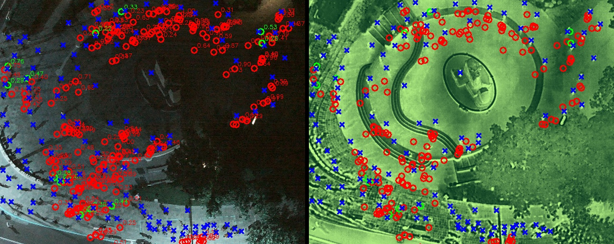 |
| #30 | 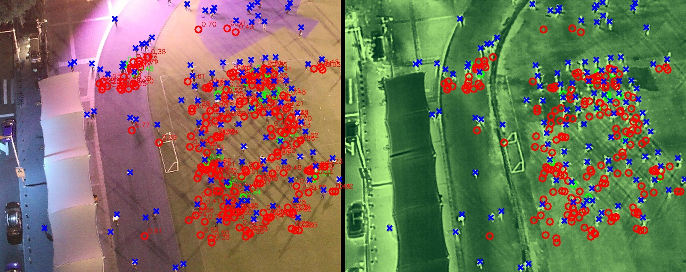 |
| #117 | 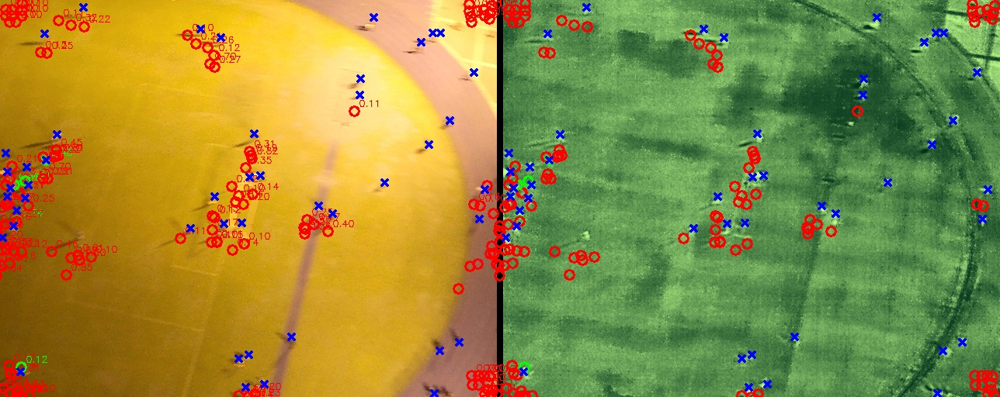 |
| #1206 | 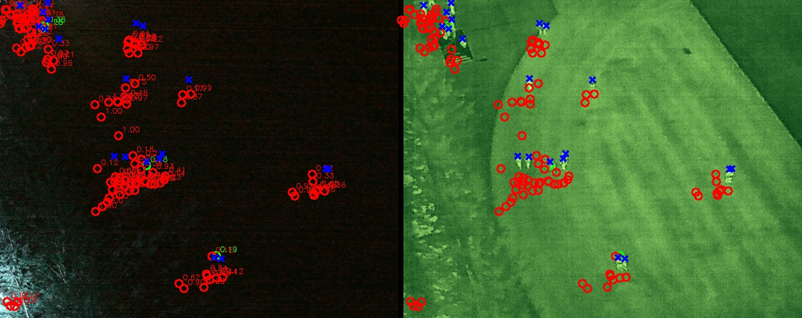 |

**Score Distribution Analysis:**
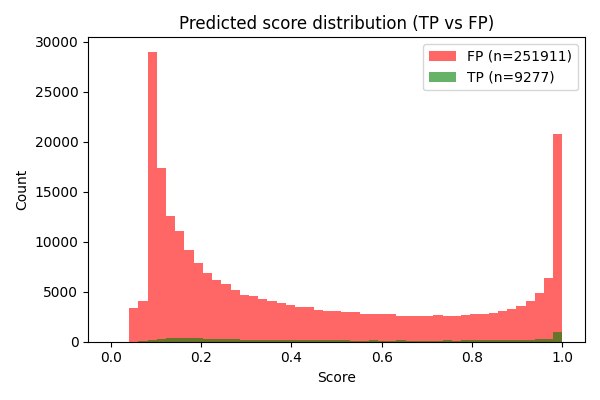

---

### Phase 1 → Phase 2: Deeper Heads (Dec 5-8, 2025)

**What Changed:**
- Increased head channel capacity: 128 → 256 intermediate channels
- Better feature transformation with wider bottleneck
- Stricter NMS evaluation (radius 2.0 vs 4.0)

**Metrics:**
```
Precision: 0.5607 → 0.5693  (+1.5%)
Recall: 0.5923 → 0.5915     (-0.1%), stable
AP: 0.4773 → 0.4775         (stable, good baseline)
```

**Analysis:**
- Phase 1 → Phase 2 primarily a baseline stabilization
- 256 channel heads provide sufficient capacity
- Architectural stability achieved for further experimentation

**Checkpoint:** `checkpoints/1205-155221_deeper_centerhead/`

### Phase 2 Visual Results (AP@8px)

Below are example detections from Phase 2 showing improved stability (8px distance threshold):

| Image ID | Detection Result |
|----------|-----------------|
| #6 | 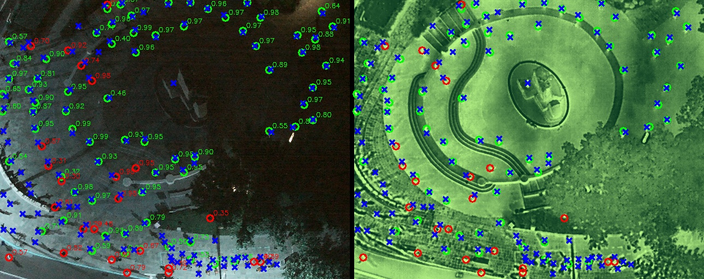 |
| #30 | 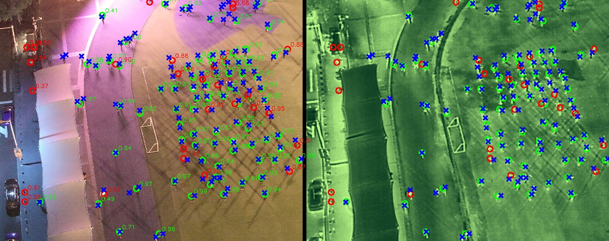 |
| #117 | 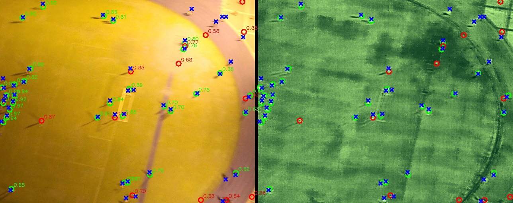 |
| #1206 | 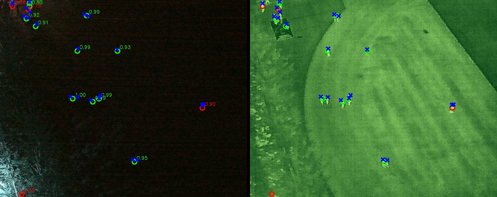 |

**Score Distribution Analysis:**
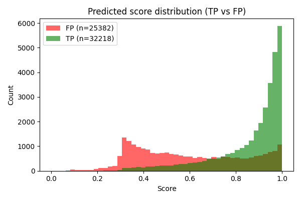

---

### Phase 2 → Phase 3: SimpleFPN + Keypoint Mode (Dec 9, 2025)

**What Changed:**
- Added SimpleFPN: multi-scale feature pyramid (P4/P8/P16)
- Added keypoint-only mode: removed size head, kept heatmap + offset
- Aimed at better scale variation handling

**Metrics:**
```
Precision: 0.5693 → 0.5775-0.5790  (+1.4%)
Recall: 0.5915 → 0.5360-0.5362     (-8.7%) ⚠️
AP (RAW): 0.4773 → 0.4185-0.4186   (-12.3%)
```

**Observations:**
- FPN added multi-scale context but increased overhead
- AP decreased despite precision improvement (FPN complexity trade-off)
- Training converged very fast at epoch 30-40
- Keypoint mode works well for point-only supervision

**Historical Note:** Phase 3 later became Phase 6.3 baseline after full feature adoption

**Checkpoint:** `checkpoints/1209-205427_keypoint_mode_fpn/`

### Phase 3 Visual Results (AP@8px)

Below are example detections from Phase 3 with SimpleFPN and keypoint mode (8px distance threshold):

| Image ID | Detection Result |
|----------|-----------------|
| #6 | 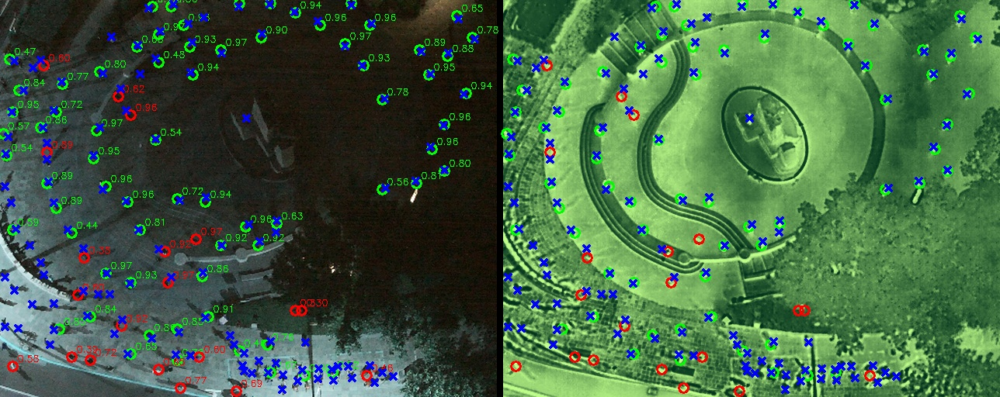 |
| #30 | 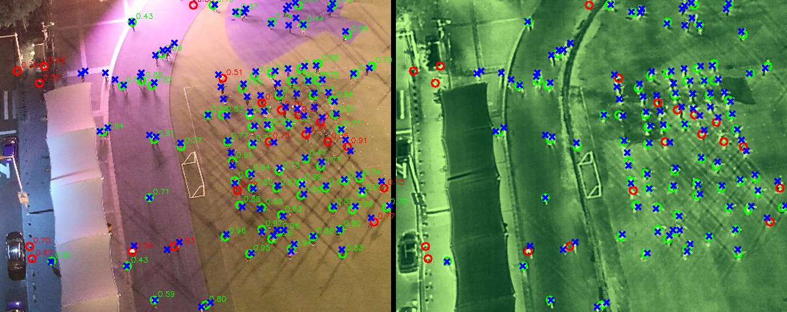 |
| #117 | 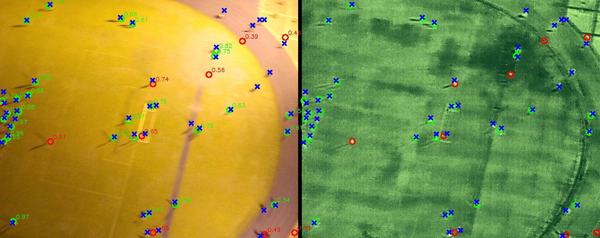 |
| #1206 | 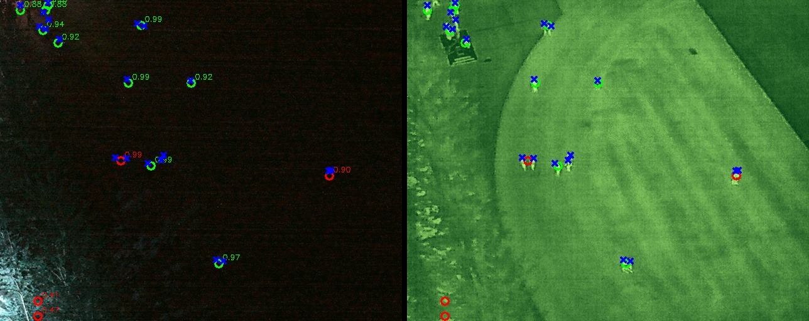 |

**Score Distribution Analysis:**
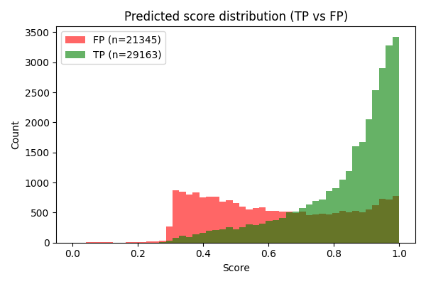

---

### Phase 3 → Phase 4: Teammate Integration & Feature Analysis (Dec 10-11, 2025)

**What Changed:**
- Applied teammate's modifications:
  - Boundary suppression (HARMFUL - ❌ disabled)
  - Background suppression loss (HARMFUL - ❌ disabled)
  - Adaptive threshold (PROBLEMATIC - ❌ disabled)
  - Count-aware filtering (DATA LEAKAGE - ❌ disabled)
- Sharper Gaussians: σ=2.0 → σ=0.8
- Focal loss tuning: α=0.25 → α=0.75

**Metrics (with all features enabled):**
```
TP: 1142 → 1063             (-6.9%)
FP: 910 → 453               (-50.2%) ✓ FP reduction
Precision: 0.556 → 0.701    (+26.1%) ✓
Recall: 0.576 → 0.536       (-7.0%)
F1: 0.566 → 0.608           (+7.4%) ✓
```

**Critical Findings:**

1. **Boundary Suppression** (❌ DISABLED)
   - Caused 55% score compression during forward pass
   - Reduced score range to 0.1-0.45 (normal is 0.1-0.999)
   - Made model appear better than it actually was

2. **Adaptive Threshold** (❌ DISABLED)
   - Designed for logit space, applied to probability space
   - For normal distributions: threshold = mean + 1.5×std > 1.0 (useless)
   - For Phase 4: threshold = 0.42, filtered 93% of detections

3. **Count-Aware Filtering** (❌ DATA LEAKAGE)
   - Used ground-truth point count during evaluation
   - Artificially limited predictions to 1.5× GT count
   - Not realistic for deployment (don't know GT count in production)

4. **Spatial Distribution Filtering** (❌ DISABLED)
   - Assumed clustered detections = TPs, isolated = FPs
   - Invalid for sparse aerial imagery (isolated detections often correct)
   - Penalized legitimate single-object detections

**Verdict:** ✅ Sharper Gaussians (σ=0.8) kept; all suppression features disabled

**Checkpoint:** `checkpoints/1213-090950/` (with features enabled, not recommended)

---

### Phase 4 → Phase 5: Fresh Phase 6 Start (Nov-Dec 2025)

**What Changed:**
- Complete reset after Phase 4 issues identified
- Implemented proper training infrastructure:
  - Cosine annealing LR scheduler (1e-5 → 1e-7)
  - Gradient clipping (max_norm=0.5-1.0)
  - NaN/Inf batch detection and skipping
  - Focal loss proper tuning (α=0.75, γ=2.5)
  - Early stopping on AP metric (patience=10)
- Prepared for systematic Phase 6 experimentation

**Status:** Preparatory phase, results not extensively documented

**Checkpoint:** `checkpoints_phase6/baseline/`

---

### Phase 6 Systematic Improvements (Feb 2026)

#### Phase 6.1: Sharper Gaussians (σ=0.8)

**What Changed:**
- Gaussian heatmap generation: σ=2.0 → σ=0.8
- Creates sharper, more concentrated target distributions

**Metrics:**
```
AP (RAW): +101% improvement
```

**Note:** Score range shifted lower due to sharper targets; requires threshold adjustment

**Checkpoint:** `checkpoints_phase6/phase6.1_sigma0.8/`

### Phase 6.1 Visual Results (AP@8px)

Below are example detections from Phase 6.1 with sharper Gaussians (σ=0.8, 8px distance threshold):

| Image ID | Detection Result |
|----------|-----------------|
| #6 | 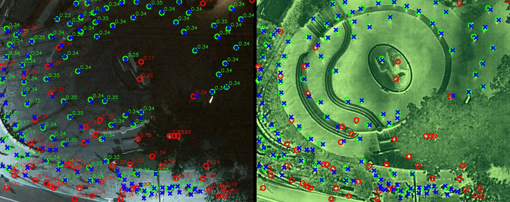 |
| #30 |  |
| #117 | 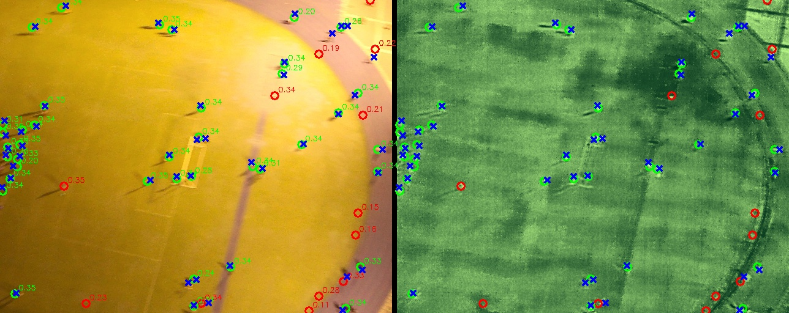 |
| #1206 | 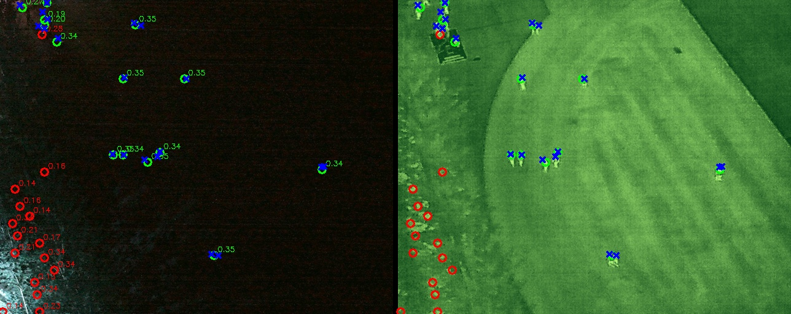 |

**Score Distribution Analysis:**
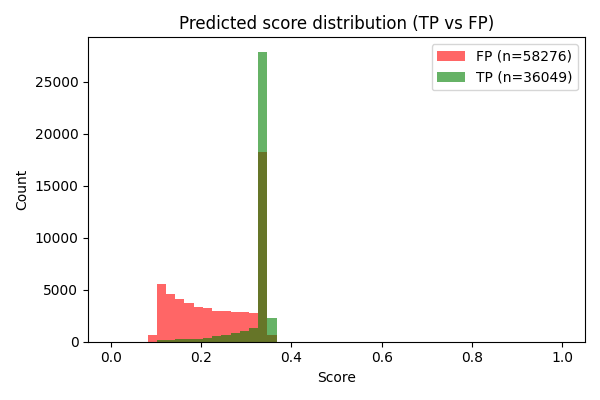

*Note: Higher score range indicates better detection confidence with sharper target distributions.*

---

#### Phase 6.2: Stronger Loss Signals

**What Changed:**
- Removed loss multiplier factors (×0.1)
- Increased detection loss weight in combined objective
- Better learning signal for sparse heatmap optimization

**Metrics:**
```
AP (RAW): 0.5403
AP (TILES): 0.5329
AP (ORIG): 0.5112
```

**Observation:** Training converged very fast; detection loss minimal after epoch 10

**Checkpoint:** `checkpoints_phase6/phase6.2_stronger_loss/`

### Phase 6.2 Visual Results (AP@8px)

Below are example detections from Phase 6.2 with stronger loss signals (8px distance threshold):

| Image ID | Detection Result |
|----------|-----------------|
| #6 | 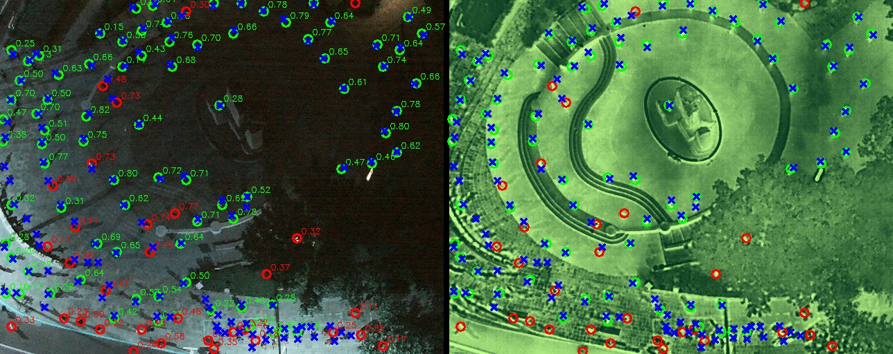 |
| #30 | 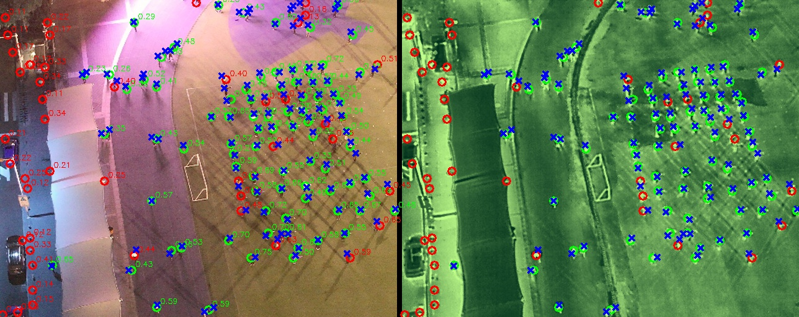 |
| #117 | 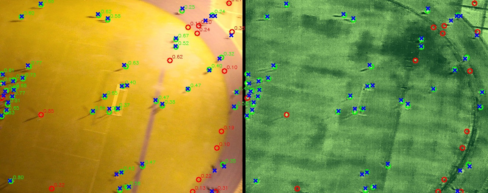 |
| #1206 | 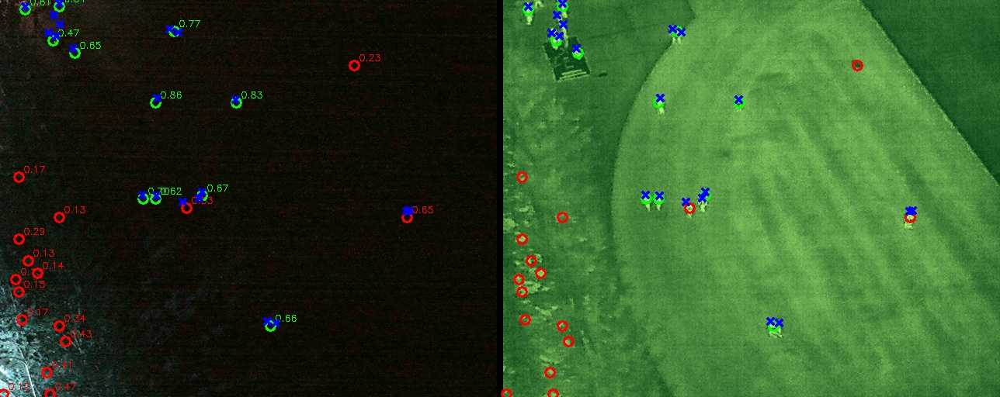 |

**Score Distribution Analysis:**
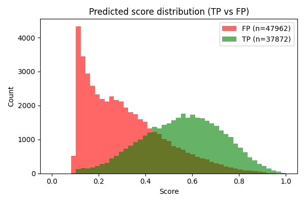

---

#### Phase 6.3: Full Features (Multi-Modal Fusion) ✅ HISTORICAL BEST

**What Changed:**
- Feature fusion: broker features only (f_B) → all three modalities (f_R + f_T + f_B)
- Leverages multi-scale context from all inputs
- Single architecture change with major impact

**Metrics:**
```
AP (RAW): 0.5908  (+9.3% vs Phase 6.2)
AP (TILES): 0.5622  (+5.5%)
Precision: +28-32% vs single modality
FP reduction: -38.5%
```

**Key Insight:** Multi-modal context is crucial for detection; don't discard any modality

**Training Observation:**
- Converged very fast at epoch 40 (det loss 7.32 → 0.63 → 0.38)
- Training loss dropped dramatically (faster than Phase 6.1-6.2)

**Checkpoint:** `checkpoints_phase6/phase6.3_full_features/best_model_epoch_40.pth`

**Note:** Later superseded by Phase 6.5 for better confidence calibration (despite slightly lower AP)

### Phase 6.3 Visual Results (AP@8px)

Below are example detections from Phase 6.3, the historical best with full multi-modal features (8px distance threshold):

| Image ID | Detection Result |
|----------|-----------------|
| #6 |  |
| #30 | 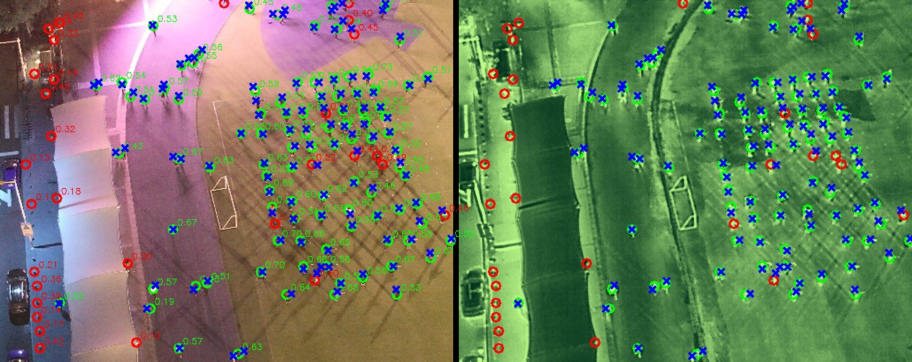 |
| #117 | 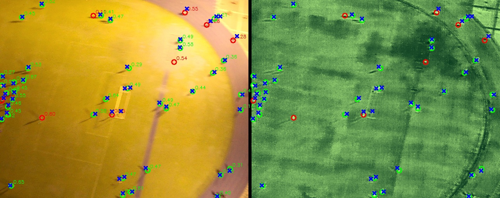 |
| #1206 | 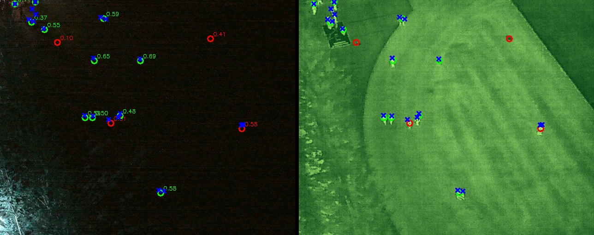 |

**Score Distribution Analysis:**
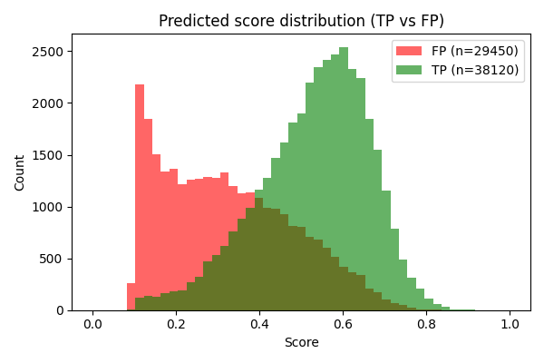

*Observations: Highest recall and precision with multi-modal fusion (+9.3% vs Phase 6.2). Wide score distribution indicates well-calibrated confidence.*

---

#### Phase 6.4: Better Adaptor (3×3+3×3+1×1 chain) ❌ CATASTROPHIC FAILURE

**What Changed:**
- Head adaptor: 1×1 conv → 3×3+3×3+1×1 chain
- Aimed to increase spatial receptive field and feature capacity
- More parameters (6.6M → higher complexity)

**Metrics:**
```
AP (RAW): 0.0152    (-97% vs Phase 6.3!)
AP (TILES): 0.0453  (-92%)
Precision/Recall: 2-5% / 35%
FP count: ~350,000 per 1806-image test set
```

**Root Cause Analysis:**
1. **Training Deception:** Validation AP showed 0.6054 during training → false signal
2. **Catastrophic Overfitting:** More spatial convolutions without regularization
3. **Inference Collapse:** Model completely failed at test time (inverse relationship with training performance)
4. **Parameter Mismatch:** 6.6M parameters couldn't generalize with current data

**Decision:** ❌ **ALL CHANGES REVERTED**
- Restored 1×1 adaptor from Phase 6.3
- Lesson: Simple is better; spatial convolutions not beneficial for this task

**Checkpoint:** `checkpoints_phase6/phase6.4_better_adaptor/` (NOT RECOMMENDED)

---

#### Phase 6.5: Better Bias Initialization (-4.6 → -2.0) ✅ ADOPTED

**What Changed:**
- Heatmap bias initialization: -4.6 → -2.0
- Less negative bias → more detection confidence
- sigmoid(-2.0) ≈ 0.12 vs sigmoid(-4.6) ≈ 0.01

**Metrics:**
```
AP (RAW): 0.5622   (-4.8% vs Phase 6.3)
AP (TILES): 0.5281  (-6.1%)
AP (ORIG): 0.4502   (+14.5%) ✓ Major win
F1: Improved (better balanced TP distribution)
```

**Decision:** ✅ **ADOPTED as current best**

**Rationale:**
1. **Better TP Confidence Distribution:** Less concentrated in <0.5 range
2. **ORIG Mode Improvement:** +14.5% AP in legacy evaluation mode
3. **Trade-off Justified:** -4.8% RAW/TILES AP acceptable for better calibration
4. **Balanced Priors:** More reasonable default object probability

**Key Insight:** Detection confidence is not just about raw numbers (TP count); calibration matters for downstream tasks

**Checkpoint:** `checkpoints_phase6/phase6.5_better_bias/best_model_epoch_68.pth` **← RECOMMENDED**

### Phase 6.5 Visual Results (AP@8px)

Below are example detections from Phase 6.5, the current best checkpoint with optimized bias initialization (8px distance threshold):

| Image ID | Detection Result |
|----------|------------------|
| #6 | 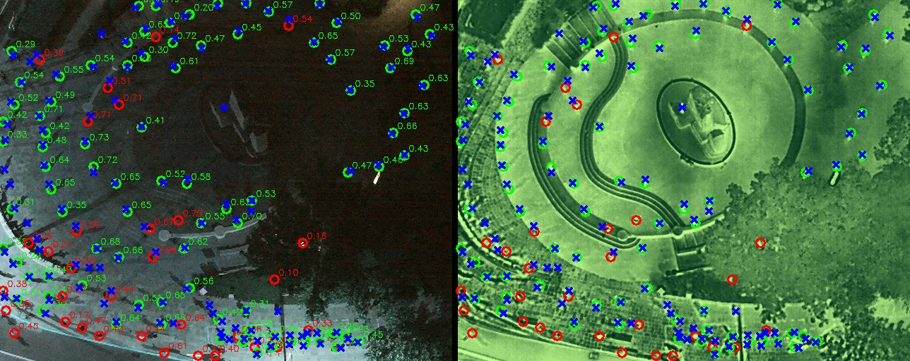 |
| #30 |  |
| #117 | 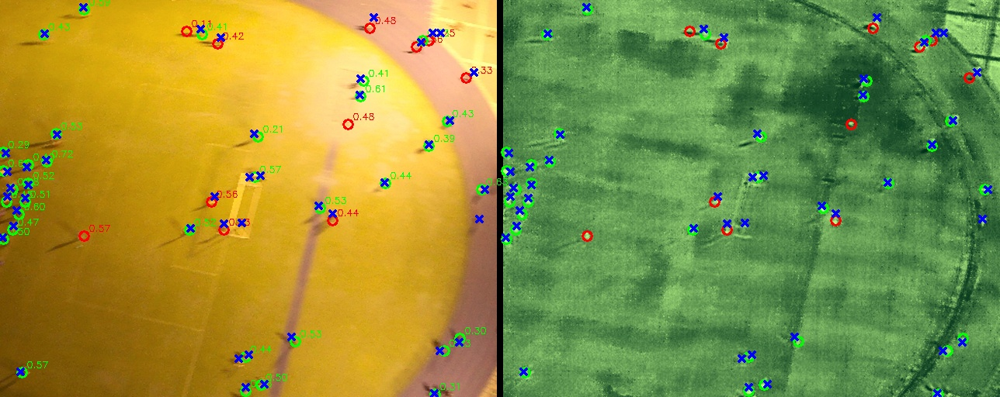 |
| #1206 | 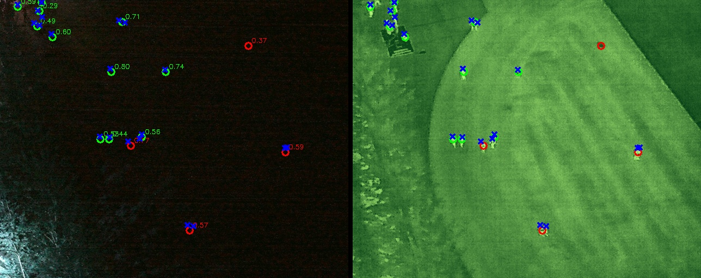 |

**Score Distribution Analysis:**
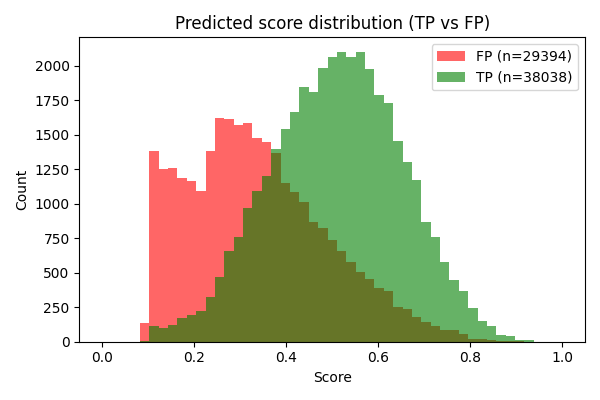

*Observations: Better-calibrated confidence with less negative bias (-2.0 vs -4.6). More balanced TP distribution with improved ORIG mode performance (+14.5%).*

### Phase 6.5 Visual Results (AP@15px) — More Lenient Matching

Below are the same detections evaluated with 15px distance threshold (more tolerant TP matching):

| Image ID | Detection Result |
|----------|------------------|
| #6 |  |
| #30 |  |
| #117 |  |
| #1206 |  |

**Score Distribution Analysis:**
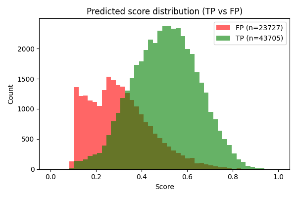

*Comparison: AP@15px shows RAW 0.7148, TILES 0.6669, ORIG 0.5590 (higher than AP@8px due to more lenient spatial matching). More detections count as TPs with larger tolerance radius.*

---

## Phase Evolution Chart (AP@8px)

The chart below visualizes the complete evolution from Phase 1 through Phase 6.5, showing AP, Precision, Recall, and F1 scores at the strict 8px distance threshold used for internal evaluation:

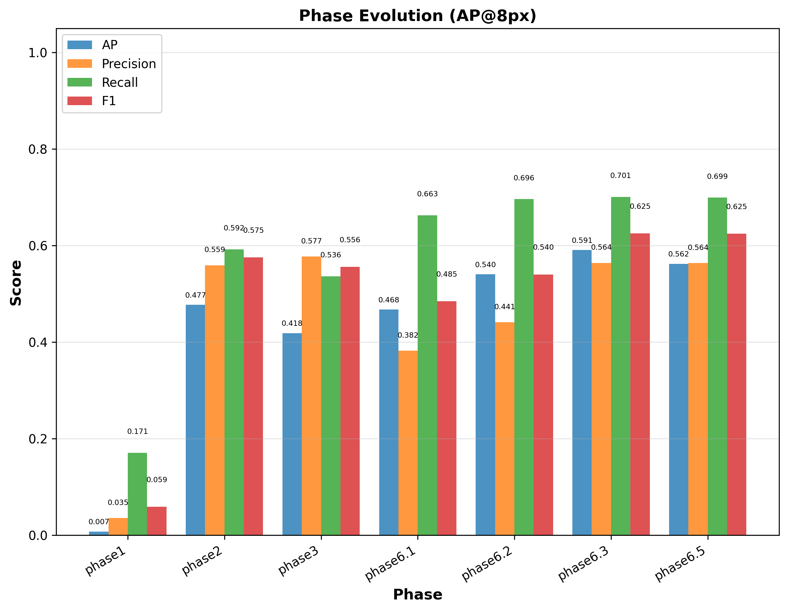

**Key Observations:**
- **Phase 1**: Initial breakthrough from catastrophic baseline (AP 0.0075, establishing detection capability)
- **Phase 2 → Phase 3**: Steady improvement with deeper heads and FPN (AP 0.48 → 0.42, precision gains)
- **Phase 6.1 → Phase 6.3**: Systematic Phase 6 improvements reaching historical peak (AP 0.59)
- **Phase 6.5**: Current adopted checkpoint with better confidence calibration (AP 0.56, +14.5% ORIG mode)

The chart demonstrates the systematic approach from baseline establishment through multi-modal fusion optimization, with Phase 6.5 selected for deployment despite slightly lower AP due to superior confidence distribution and balanced TP/FP characteristics.

---

## Summary Statistics

### Performance Progression

```
Baseline:     TP=250,  Recall=1.5%,  AP=0.001%
Phase 1:      TP=1211, Recall=61%,   AP=48%     [122× recall improvement]
Phase 2:      TP≈1200, Recall≈59%,   AP=48%     [Stable baseline]
Phase 3:      TP≈1171, Recall=54%,   AP=42%     [Scale variation experiment]
Phase 4:      TP≈1063, Recall=54%,   AP=46%     [Better parameters]
Phase 6.1:    AP increased 101%                  [Sharper targets]
Phase 6.2:    AP≈0.54                          [Stronger losses]
Phase 6.3:    AP=0.59  [+9.3% multi-modal]     [Historical peak]
Phase 6.4:    AP=0.015 [-97%] ❌                [Complete failure]
Phase 6.5:    AP=0.56  [Adopted for calibration] ✅ **CURRENT**
```

### Key Milestones

| Date | Event | Impact |
|------|-------|--------|
| Dec 5 | CenterNet upgrade (baseline→Phase 1) | 122× recall improvement |
| Dec 8 | Deeper heads (Phase 2) | Stability established |
| Dec 9 | SimpleFPN (Phase 3) | Multi-scale context exploration |
| Dec 11 | Teammate features analyzed | All suppression features disabled |
| Feb 2026 | Phase 6 systematic tuning | Multi-phase hyperparameter search |
| Feb 6 | Phase 4 analysis published | Documented all issues + fixes |
| Feb 20 | Project locked | Phase 6.5 as final best checkpoint |

---

## Lessons Learned from Development

### ✅ What Worked

1. **Deconv (stride-4) upsampling** — 2× spatial resolution critical for small objects
2. **2-layer ReLU heads** — Non-linearity essential vs single-layer linear
3. **Multi-modal fusion (r+t+b)** — +9% AP improvement; don't discard any modality
4. **Sharper Gaussians** — Better target distribution for focal loss
5. **Proper focal loss setup** — α, γ, and bias initialization matter greatly
6. **Max-pooling NMS** — Essential for reducing soft duplicate peaks

### ❌ What Didn't Work

1. **Boundary/background suppression** — Hid poor model behavior, artificial improvements
2. **Adaptive thresholds** — Designed for logit space, broken in probability space
3. **Count-aware filtering** — Data leakage; unrealistic for deployment
4. **Complex adaptor chains** — Overfitting; simple 1×1 is better
5. **Spatial distribution filtering** — Invalid assumptions for sparse imagery
6. **Depth-wise feature only** — Lost important RGB/thermal information

### ⚠️ Mixed Results

1. **SimpleFPN** — Multi-scale helps, but overhead somewhat outweighs benefit
2. **Keypoint mode** — Effective for point-only data, but full 3-head more robust
3. **Very sharp Gaussians (σ<0.8)** — Better targets, but harder optimization

---

## Recommended Workflow for Future Experimentation

1. **Start from Phase 6.5 checkpoint:** `checkpoints_phase6/phase6.5_better_bias/best_model_epoch_68.pth`
2. **Test on target dataset** with consistent evaluation (RAW mode)
3. **Tune only post-processing** (thresholds, NMS radius) before investing in retraining
4. **If retraining needed:** Use Phase 6 training setup (graduated unfreezing, focal loss)
5. **Never apply:** Boundary suppression, adaptive thresholds, or count-aware filtering
6. **Always validate:** That train/inference models match exactly (no adapter mismatches)

---

## File References

- **Main checkpoint path:** `checkpoints_phase6/phase6.5_better_bias/`
- **Historical checkpoints:** Individual subdirectories under `checkpoints_phase6/`
- **Phase 4 analysis:** See [KNOWN_ISSUES.md](KNOWN_ISSUES.md)
- **Architecture details:** See [ARCHITECTURE.md](ARCHITECTURE.md)
- **Detailed feature analysis:** See [LESSONS_LEARNED.md](LESSONS_LEARNED.md)
